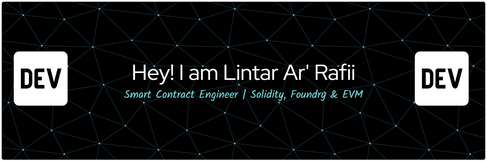

# 💫 About Me:
I am a **Smart Contract Engineer** focused on designing, testing, and deploying secure, high-performance, and gas-efficient EVM protocols.

# 💻 Tech Stack:
####  Solidity | Foundry | Anvil | Git
# 📊 GitHub Stats:
 
 

## 🌐 Socials:
  

## 🏆 GitHub Trophies

### 🔝 Top Contributed Repo

---

<!-- Proudly created with GPRM ( https://gprm.itsvg.in ) -->